# Viona's WADS LAB Week 8 Assignment

## Signing up a user using the POST /service/user/signup to create a new account
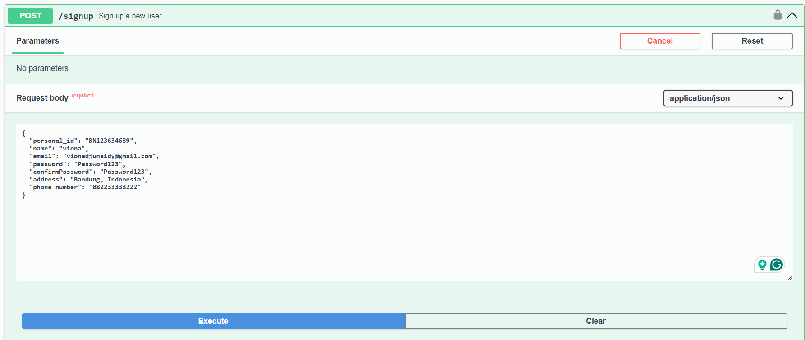
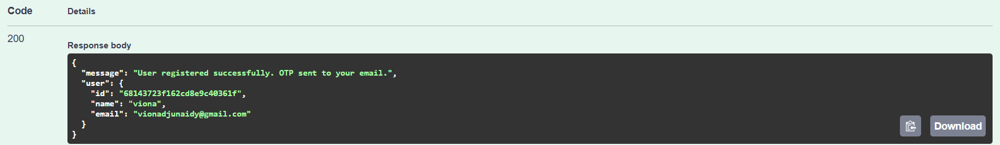

Once the signup is successful, the OTP is sent to the user's email. 
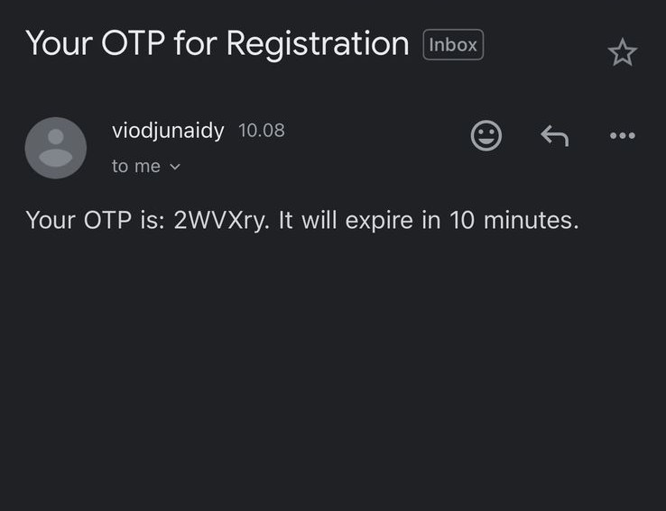

Then, the user can verify their email using the POST /service/user/verify-otp
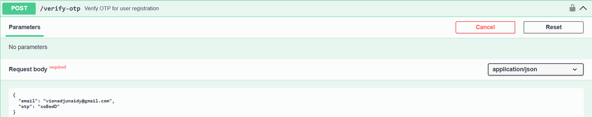
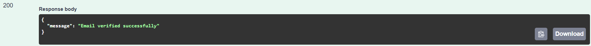

## Signing in to an account using the POST /service/user/signin
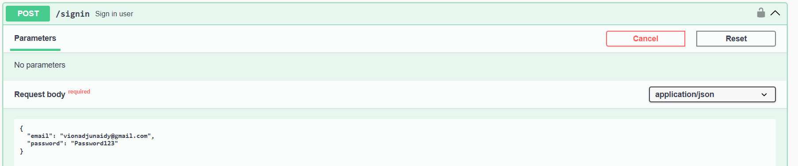
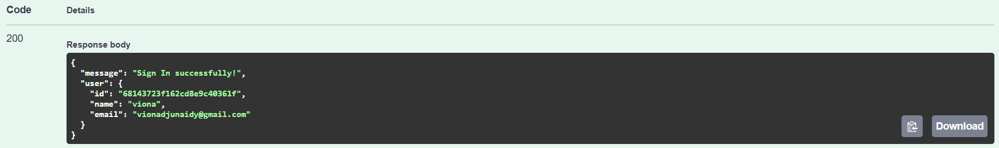

## Complete authorization by inserting the token given in the signin response 

## Update a user detail with PATCH /service/user/update-user
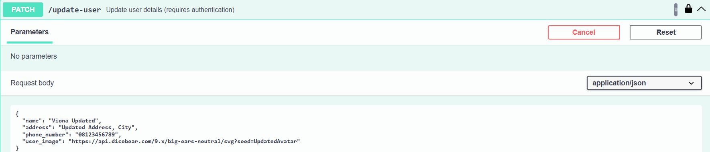
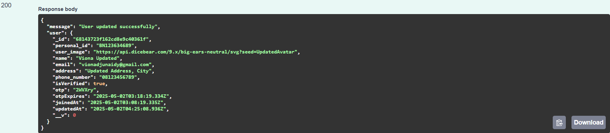

## Delete a user with DELETE /service/user/delete-user

## Add a todo with POST /service/todo/add_todo
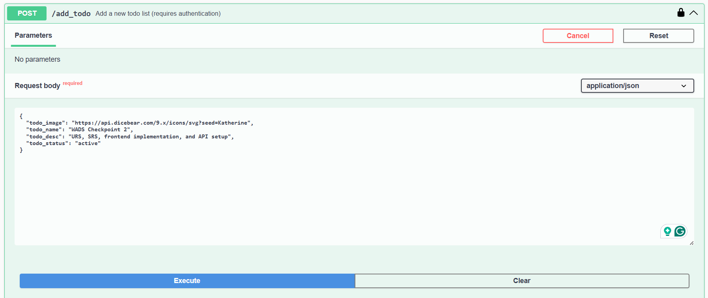
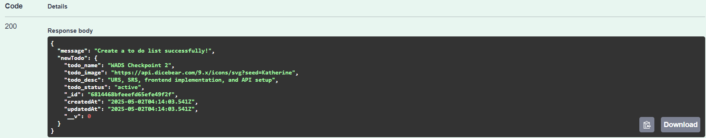

## Update a todo with PATCH /service/todo/update_todo/{id}
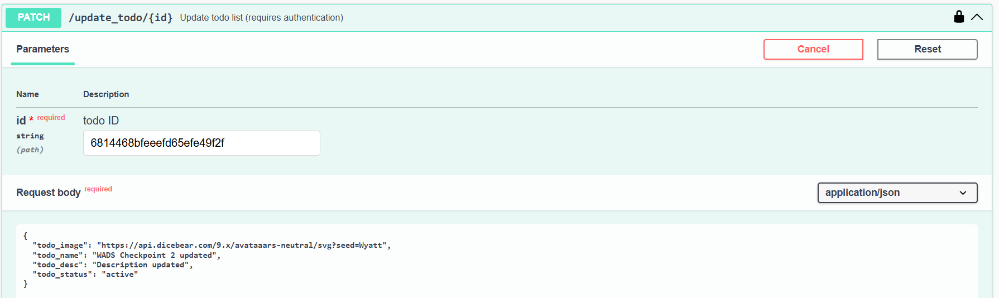
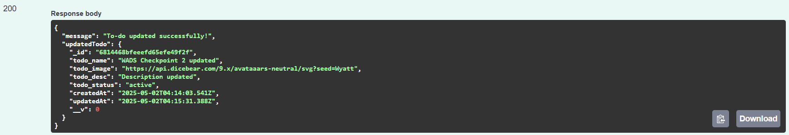

## View all todo saved by an authenticated user with GET /service/todo/get_all
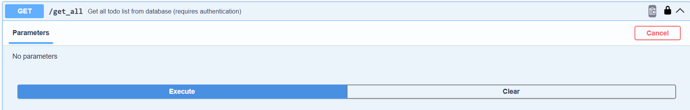
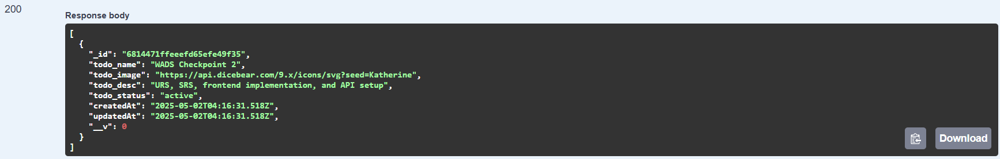

## Delete a todo saved by an authenticated user with DELETE /service/todo/delete_todo/{id}
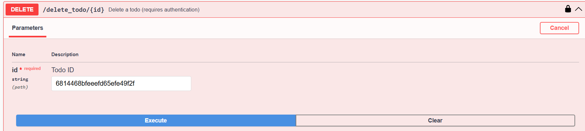
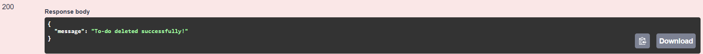

## Docker
Docker was set up for the project and can be monitored in the Docker Desktop
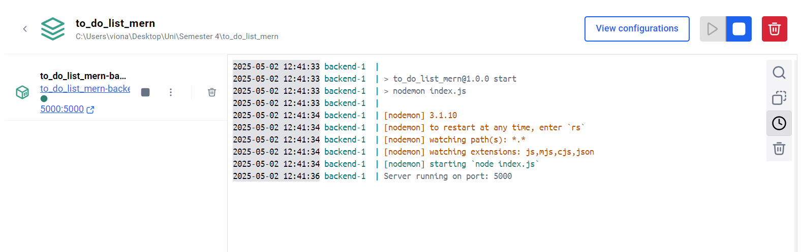
