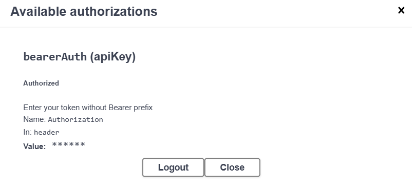

# Viona's Todo App

## User
1. Sign up a new user with POST /service/user/signup

2. OTP sent to the user's email

3. Verify email with POST /service/user/verify-otp

4. Sign in with POST /service/user/signin

5. Update user details of an authenticated user with PATCH /service/user/update-user

6. Get user info of an authenticated user with GET /service/user/user-infor

7. Delete a user of an authenticated user with DELETE /service/user/delete-user

## Authorize
Authorize the account by inserting the token from the response when signing in.

## Todo
1. Add a todo saved in an authenticated user’s account with POST /service/todo/add_todo

2. Update a todo saved in an authenticated user’s account with POST /service/todo/update_todo/{id}

3. Retrieve all the saved todos of an authenticated user’s with GET /service/todo/get_all

4. Delete a todo of an authenticated user with DELETE /service/todo/delete_todo/{id}

